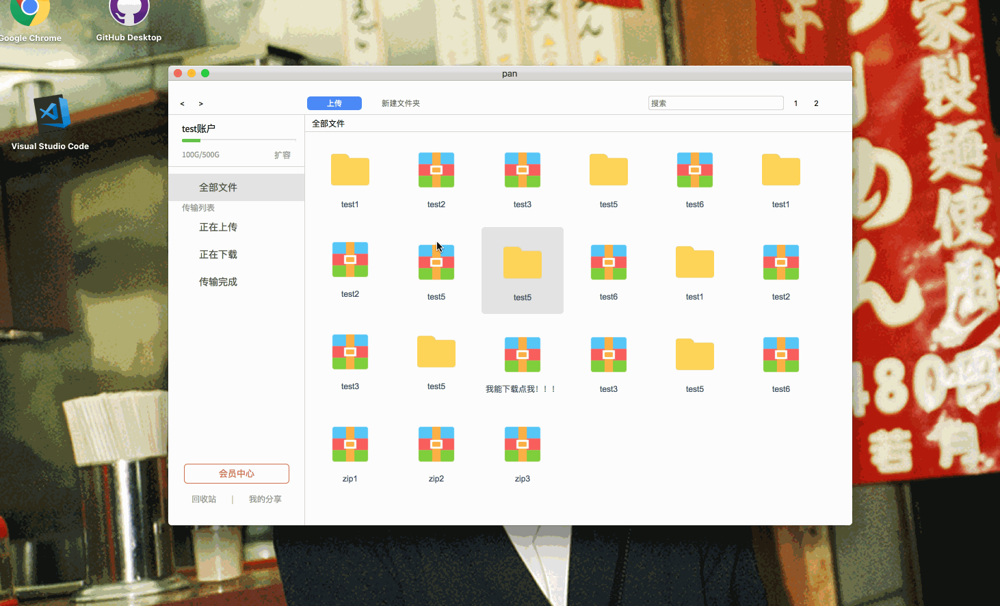
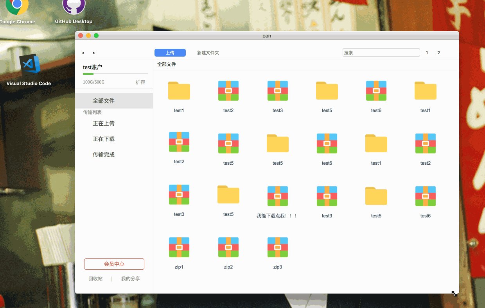
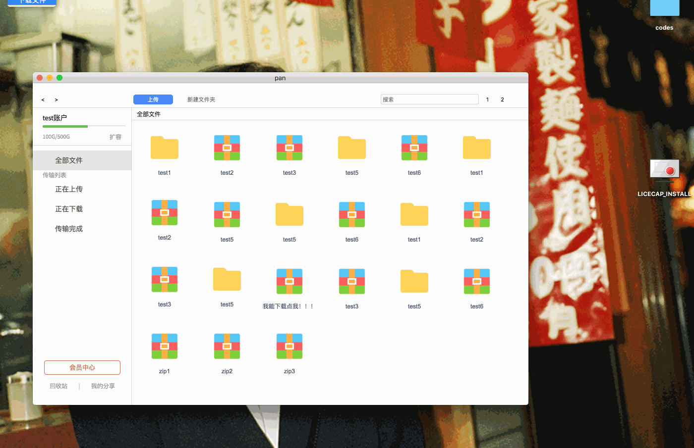

# electron版百度网盘

## 项目介绍
用electron + vue2.x开发简易百度网盘PC版，实现简易界面和交互。

## 项目安装

``` bash
# 安装依赖
npm install / cnpm install

# 启动调试
npm run dev

# 打包
npm run build
```
## 预览

#### 主界面1


#### 主界面2


#### 浮动窗口


## TODO
 - [ ] 尝试玩玩webassembly, 2019.11
